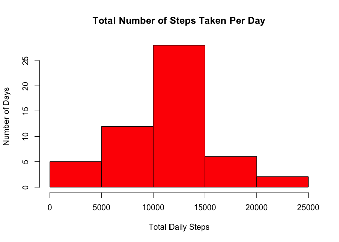
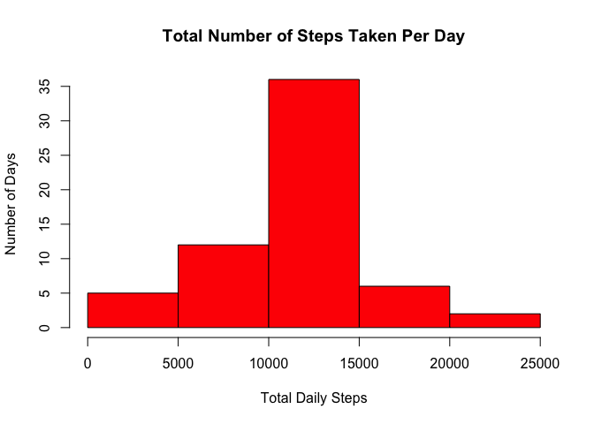

# Reproducible Research: Peer Assessment 1

## Loading and preprocessing the data
1. Set the working directory to the forked project repo. 
2. Unzip the archive containing the activity data
3. Load the activity data csv file into R

```r
setwd("/Users/Simon/datasciencecoursera/RepData_PeerAssessment1")
unzip("activity.zip")
activity<-read.csv("activity.csv")
```

## What is mean total number of steps taken per day?
To calculate the total number of steps taken per day, aggregate the recorded
measurements from all of the 5 minute intervals for each day. 

```r
dailysteps<-aggregate(steps~date, activity, sum)
```

The following histogram organizes the total steps taken each day into 
value bins:

```r
hist(dailysteps$steps, col="red", xlab="Total Daily Steps", 
     ylab="Number of Days", main="Total Number of Steps Taken Per Day")
```

 

The **mean** number of steps taken per day is:

```r
mean(dailysteps$steps)
```

```
## [1] 10766.19
```
The **median** number of steps taken per day is:

```r
median(dailysteps$steps)
```

```
## [1] 10765
```

## What is the average daily activity pattern?

To show how activity varies throughout the day calculate the daily mean 
of recorded steps for each of the 5 minute data collection intervals.

```r
activitypattern<-aggregate(steps~interval, activity, mean)
```

Using these averaged step counts, a time series plot shows activity levels
throughout the data.

```r
with(activitypattern, {
        plot(interval, steps, type="l",ylab="Steps",
             xlab="5-minute Interval Number")
})
```

 

The interval with the maximum number of average steps is:

```r
subset(activitypattern, steps==max(activitypattern$steps))
```

```
##     interval    steps
## 104      835 206.1698
```

## Imputing missing values
Check for the number of rows in the data with missing values:

```r
nrow(activity[!complete.cases(activity),])
```

```
## [1] 2304
```

Replace the missing values with the average from all days for each
five-minute interval.

```r
library(plyr)
NAreplace<-join(activity[!complete.cases(activity),], activitypattern, 
type="left", by="interval")
completeactivity<-activity
completeactivity[!complete.cases(completeactivity),1]<-NAreplace[,4]
```

To calculate the total number of steps taken per day, aggregate the recorded
measurements from all of the 5 minute intervals for each day. 

```r
completedailysteps<-aggregate(steps~date, completeactivity, sum)
```

The following histogram organizes the total steps taken each day into 
value bins:

```r
hist(completedailysteps$steps, col="red", xlab="Total Daily Steps", 
     ylab="Number of Days", main="Total Number of Steps Taken Per Day")
```

 

The **mean** number of steps taken per day is:

```r
mean(completedailysteps$steps)
```

```
## [1] 10766.19
```
The **median** number of steps taken per day is:

```r
median(completedailysteps$steps)
```

```
## [1] 10766.19
```

There is no difference in the mean number of steps taken each day with the 
5 minute interval mean substitution. 

```r
mean(completedailysteps$steps)-mean(dailysteps$steps)
```

```
## [1] 0
```

The median of the data increases with substitution of the 5 minute interval mean 
for the NA values:

```r
median(completedailysteps$steps)-median(dailysteps$steps)
```

```
## [1] 1.188679
```

## Are there differences in activity patterns between weekdays and weekends?

activityDOW<-paste(completeactivity,weekdays(as.POSIXct(completeactivity$date)))
head(activityDOW)
